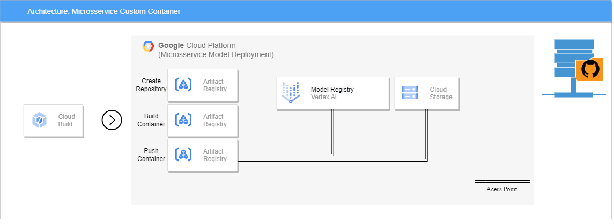
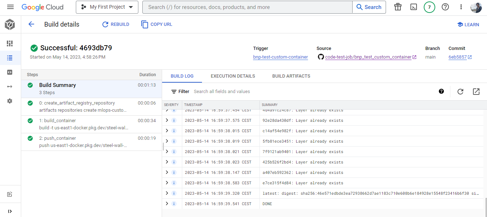
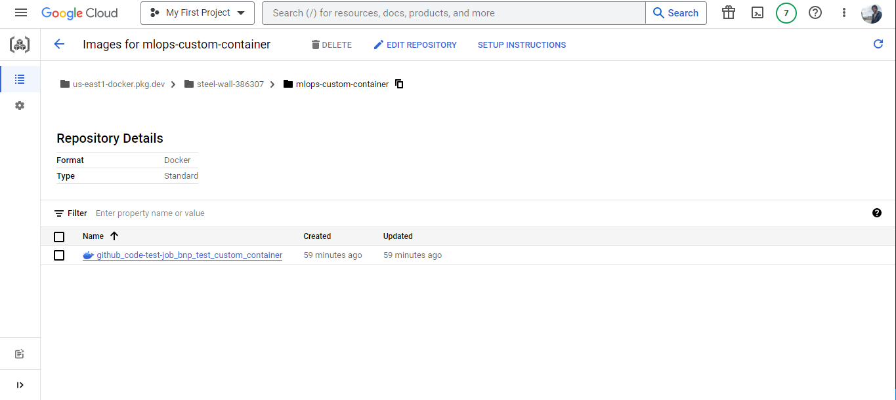

# BNP PARIBAS - TEST
Bonjour!

*OBS1 :* Lisez attentivement le fichier README.md;

<h1>Comment marche cette solution?</h1>

Vertex AI a généralement des images prédéfinies, comme les images scikit-learn, tensorflow et xgboost. Ici, nous traiterons "long_calculation" comme s'il s'agissait d'un modèle et créerons un container personnalisé pour celui-ci. L'architecture de ce microservice est la suivante: 

  

L'idée est de créer un container personnalisé qui sert de point d'accès pour Cloud Storage (où le modèle .pkl serait stocké s'il existait) et pour Vertex AI (où le modèle sera déployé dans un autre microservice). Les instructions de déploiement sont présentes dans cloudbuild.yaml. 

Le push vers la branche déclenche l'exécution des instructions dans cloudbuild.yaml, comme on peut voir ci-dessous: 

  

Tout est vert, c'est-à-dire, toutes les instructions ont été exécuté avec succès, c'est pour cela qu'on peut donc voir l'image sur Artifact Registry: 

  

Certaines modifications ont été apporté dans app/main.py, parmi lesquelles la route heath_check et la route predict (Routes obligatoires pour l'intégration des containers avec Vertex AI). Désormais, les problèmes de l'équipe 1 et de l'équipe 2 peuvent être résolus d'une seule manière, puisque le endpoint pourra recevoir une seule valeur, ou une liste de valeurs, n'ayant plus besoin de la sdk avec un for-loop de l'équipe 2.

À partir de maintenant, nous avons un container en cloud, la prochaine étape consiste à déployer le modèle + endpoint dans un autre microservice.

<h1>Structure des dossiers</h1>

<h2>Files</h2>

- `.gitignore`: Fichiers et répertoires à exclure du suivi et de la gestion des modifications;
- `cloudbuild.yaml`: CI/CD - Cloud Build;
- `Dockerfile`: Instructions pour construire l'image Docker;
- `nginx.conf`: Configuration pour le serveur web Nginx;
- `README.md`: Instructions du projet/solution;
- `requirements.txt`: Dépendances et packages nécessaires à l'exécution du projet;

<h2>Dossiers|Packages</h2>

- `app`: APP pour l'équipe A;
- `img`: Images pour le ReadME.md;
- `tests`: Package avec les fonctions de test;

<h1>Suggestion de branches</h1>

- [x] master - Deploy en PROD
- [x] hml    - Deploy en STAGGING
- [x] dev    - Deploy en DEVELOPEMMENT

<h1>Services GCP utilisées</h1>

- [x] Source Repository 
- [x] Cloud Build
- [x] Artifact Registry

